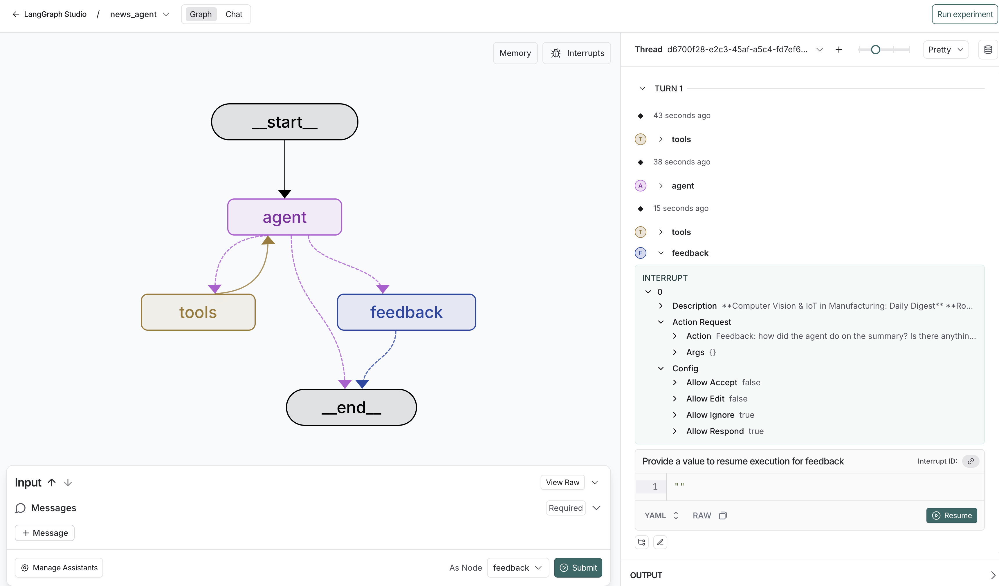
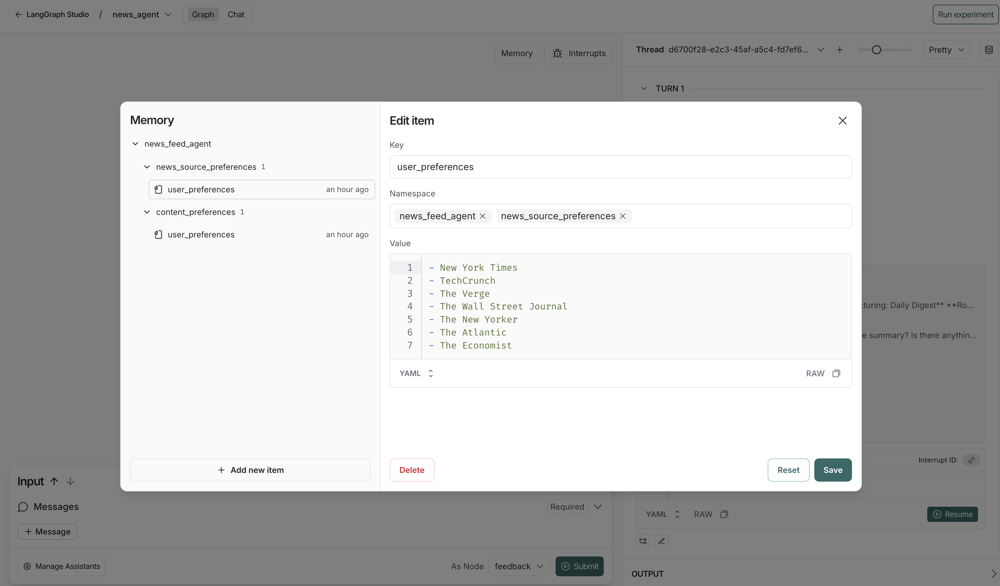

# News Agent

A simple AI-powered news aggregation agent built with LangGraph that crawls your preferred news sources and provides personalized news summaries based on your interests.

## Overview

This news agent can:
- Provide daily news debriefs from your preferred sources
- Share interesting news facts
- Summarize news from specific sources
- Learn and adapt to your content preferences over time

The agent uses [Tavily](https://www.tavily.com/) for web crawling and OpenAI GPT-4.1 for intelligent content curation.

## Installation
1. Clone this repository
2. Create a virtual environment
3. Install dependencies using uv:
   ```bash
   uv sync
   ```

## Environment Setup

Copy the `.env.example` file and rename it to `.env`, then fill in the API keys for LangSmith, OpenAI, and Tavily.


## Running

Start the LangGraph server:

```bash
langgraph dev
```

The dev command will launch the LangGraph Studio interface that you can interact with the graph through.

You can ask the agent things like:
- "Give me today's daily digest"
- "What's an interesting tech fact from today?"
- "Summarize the latest from TechCrunch"

The agent should learn your preferences over time and you provide feedback and provide increasingly personalized results. 


## Demo

### Agent Graph Structure


The news agent uses a LangGraph workflow that includes web crawling tools, content curation, and a feedback loop for learning user preferences.

### Memory and Personalization


The agent maintains separate memory profiles for news source preferences and content preferences, allowing it to provide increasingly personalized results over time.
